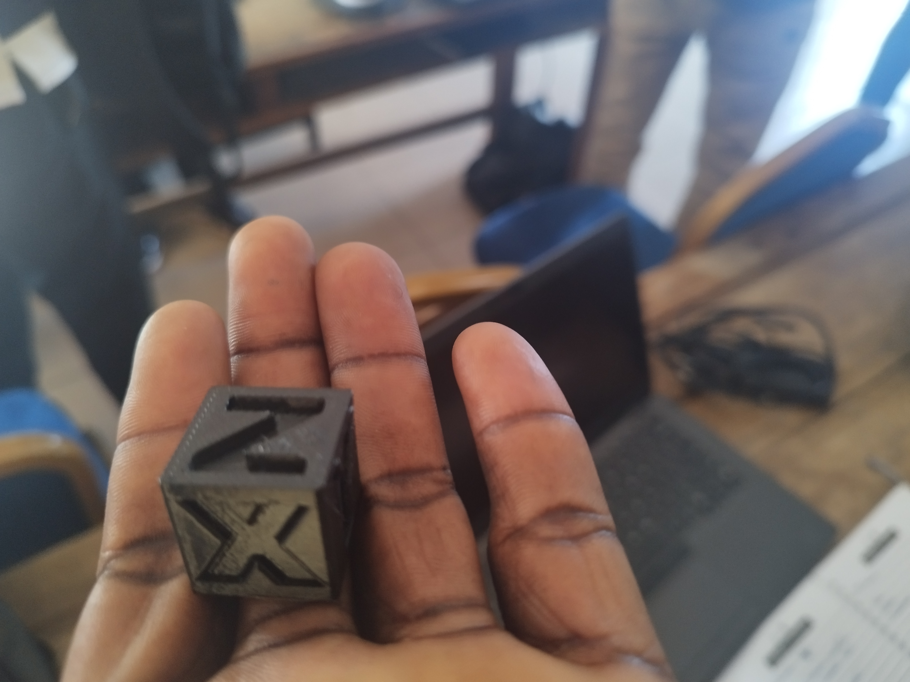

# journal du 27 Août 2026 (Réadigé Par : Gnon ALI )
# Fait aujourd'hui
* Aujourd'hui nous avons continué dans les groupes déja crée hier pour approfondire un peu plus les modules vue hier    
* notre premier module aujourd'huie était dans la salle deux ( 2 ) appelé salle élèctrnique . dans un premier temps nous avons fait le rappel d'hier ensuite nous avons poursuivi avec les notion d'entré et de sortie en électronique 
* présentation du cyberpi suivi des objectifs pedagogiques 
* instalation de l'application mBLOCK pour le premier projet sur la veilleuse automatique 
* Le module 2 etait présenté dans la salle 3 par L'ingenieur LOLO pour la deuxieme partie de l'impression 3D 
* instalation du logiciel Bambou studiio et aplication de limpression d'un cube dont une face est mentionné X; l'autre Y et la troisieme face Z

 
* le module 3 etait dans la salle 1 de coupe laser dont nous avons imprimé nos carte de visite personnel ki sera imprimé le lendemain 
 
# APPRIS
* instalation de l'application Bambou studio et son utilisation dans la réalisation d'un cube  
* saisie d'une carte de visite avec l'application Xtool
* instalation de l'application mBlock et son utilisation pour realiser le premier projet des LED qui s'allume l'une aprè l'autre apres une seconde 

# RATE PUIS APPRIS 
* Ereur lors de l'instalation de l'application mblock mais par l'aide du formateur je l'est finalement instalé 
* erreur du code de branchement des LED avec le logiciel 
* jai finalement reussi a le faire avant la fin de l'heur  
*  
# DECIDE 
  * l'utilisation correcte des logiciel instalé au cour de la formation 
  * chercher a perfectionner l'utilisation de ses logiciel. 
  # A FAIRE DEMAIN 
  continuté dans les different atelier de formation 